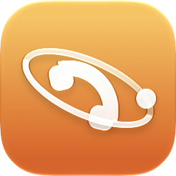

<p align="center">
  
  
</p>

# Hermes Call

Private, self-hosted phone calls and chat between your iPhone and your own
[Hermes Agent](https://hermes-agent.nousresearch.com/). Your agent can ring your phone
(a real CallKit call, also on the lock screen), you can call it or text it from the app, and it can
ask your phone for context you allow. Your Hermes host never accepts inbound connections: everything
goes through a small relay you run yourself, which only ever sees ciphertext.

## What it does

- **Calls both ways** — CallKit on the iPhone, WebRTC audio to a bridge next to Hermes, speech
  recognition on the bridge (Whisper) or on the iPhone, Kokoro text-to-speech, barge-in, push to talk,
  live captions, approvals for dangerous commands with Face ID (never by voice).
- **Chat** — replaces a messenger bot: text, photos, files and voice notes (answered by voice if you
  like), end-to-end encrypted mailbox on the relay, notifications decrypted on the phone, inline reply,
  share extension, Siri and Shortcuts.
- **Phone context** — the agent may ask for location, calendar, reminders, contacts, battery, health
  summary, Home accessories, clipboard, photos, files and place reminders. Every capability is
  **No / Ask / Yes** on the phone, **No** by default, and every request is logged there.
- **Presentations** — results (places, links, lists) arrive as cards; the bridge fetches images so the
  phone never contacts third parties.
- **Tasks** — longer agent work shows as a progress ring and as a Live Activity on the Lock Screen and
  in the Dynamic Island.
- **"Look at this"** — during a call, show the agent what the camera sees (single pictures or one every
  few seconds).
- **HUD appearance** — an optional full-screen interactive "presence" (Metal) that listens, thinks and
  speaks with the real voice spectrum; one colour per paired agent, swipe to switch agents.
- **Apple Watch** (start calls and dictate messages through the iPhone), widgets, Control Center
  control, switchable Liquid Glass app icons.

## How it fits together

```
iPhone app ──TLS── relay (yours; forwards ciphertext, TURN, APNs) ──TLS── hermes-call-bridge ── Hermes
   └───────────── end-to-end: CPace pairing → crypto_box signalling → DTLS-SRTP audio ─────────────┘
```

| Path | What |
|---|---|
| `relay/` | Relay: pairing rendezvous, E2E routing, mailbox and blobs, TURN (coturn), pushes ([docs](docs/relay.md)); push gateway ([docs](docs/push-gateway.md)) |
| `bridge/` | `hermes-call-bridge` next to Hermes: voice pipeline, calls, chat, phone queries ([docs](docs/bridge.md)) |
| `hermes-integration/` | Hermes plugin: `call_owner`, `phone_context`, `present_to_owner` tools and the `hermes_call` chat platform ([docs](docs/bridge.md)) |
| `common/` | Shared protocol and crypto (libsodium, CPace) |
| `ios/` | SwiftUI app, extensions, Apple Watch app ([docs](docs/ios.md)) |
| `proxmox-helper/` | community-scripts style LXC helper; installs only signed releases |
| `testclient/` | command-line stand-in for the iPhone |
| `tools/` | local dev stack, release signing, icon generator |

Documentation: [relay](docs/relay.md) · [bridge and plugin](docs/bridge.md) · [iOS app](docs/ios.md) ·
[push gateway](docs/push-gateway.md) · [wire protocol](docs/protocol.md) · [chat design](docs/chat-design.md) ·
[threat model](THREAT_MODEL.md) · [changelog](CHANGELOG.md)

## Privacy in one paragraph

No analytics, no crash reporting, no third-party services. Audio, messages, attachments and phone
answers are end-to-end encrypted between your phone and your bridge; the relay sees only who talks to
whom, when and how much. Apple, and the Hermes Call [push gateway](docs/push-gateway.md) your relay
uses unless it has its own APNs key, see push tokens and timing (and, for Live Activities, only a step count
and a generic label unless you allow more). What the agent may read from your phone is off until you
turn it on. Details, including what is deliberately out of scope: [THREAT_MODEL.md](THREAT_MODEL.md).

## Getting started

### Quick start on Proxmox VE

**Relay**: one command on the Proxmox host, as root. It creates an unprivileged Debian 13 LXC,
installs the signed release (the signature is checked before anything runs) and prints a pairing
code. Pushes to the phone go through the Hermes Call push gateway, so no Apple account is needed.

```bash
bash -c "$(curl -fsSL https://raw.githubusercontent.com/Quavon-dev/hermes-call/main/proxmox-helper/ct/hermes-call-relay.sh)"
```

It asks on the host, also with the default settings:

1. The **domain** for the relay. Its DNS A record must point at your public IP (the helper warns if
   it does not yet). Leave it empty and the relay runs on your public IP with a self-signed
   certificate that the app pins through the pairing QR.
2. Who handles **HTTPS** for that domain: the relay itself (Let's Encrypt; forward TCP 443 to the
   container), or the reverse proxy that already publishes your services (Nginx Proxy Manager,
   Traefik, Caddy; it forwards to `http://<container>:8743` with Websockets on). For the proxy,
   optionally its IP: only it may reach port 8743.

Either way, forward TCP/UDP 3478 and UDP 49160–49200 from the router straight to the container
(TURN cannot go through an HTTP proxy; [details](docs/relay.md)). Unattended:
`var_relay_address=relay.example.com var_relay_tls=proxy var_relay_proxy_from=192.168.0.10` in
front of the command.

**Bridge**: into the container that runs Hermes (replace `121` with its ID):

```bash
pct exec 121 -- bash -c 'apt-get install -y -qq git >/dev/null && git clone --depth 1 https://github.com/Quavon-dev/hermes-call /root/hermes-call && /root/hermes-call/bridge/install.sh install --configure-hermes'
```

**Pair**: `hermescall-relay pair` in the relay container gives a link; run
`hermes-call-bridge relay add '<link>'` and then `hermes-call-bridge device add --name iPhone` in the
Hermes container, and scan the QR code with the app. Restart Hermes and its gateway once so they
load the plugin.

### Other hosts

1. **Relay** on a small VPS or LXC with a public address: `relay/install.sh` ([docs](docs/relay.md)).
2. **Bridge** next to Hermes: `bridge/install.sh`, then pair it with the relay ([docs](docs/bridge.md)).
3. **Hermes plugin**: install `hermes-integration/hermes-call` into Hermes ([docs](docs/bridge.md)).
4. **iPhone app**: the published app (TestFlight, then the App Store), or build it with Xcode
   under your own Apple developer account ([docs/ios.md](docs/ios.md#build-your-own-copy)).

## Development

```bash
brew install libsodium shellcheck xcodegen && uv sync
uv run ruff check . && uv run pytest -q bridge/tests common/tests relay/tests
(cd ios/HermesCallKit && swift test)
```

Local end-to-end stack (relay + bridge + fake Hermes on your LAN):
`uv run python tools/dev_stack.py --host <your LAN IP>`. Installer tests in systemd containers:
`./relay/tests/container_e2e.sh debian:12` and `./bridge/tests/container_e2e.sh`.
More in [CONTRIBUTING.md](CONTRIBUTING.md); security reports: [SECURITY.md](SECURITY.md).

## License

MIT © Quavon UG (haftungsbeschränkt). Third-party components and their licences:
[THIRD_PARTY_NOTICES.md](THIRD_PARTY_NOTICES.md). The app icons and the presence are original work;
Hermes Call is not affiliated with Nous Research.
