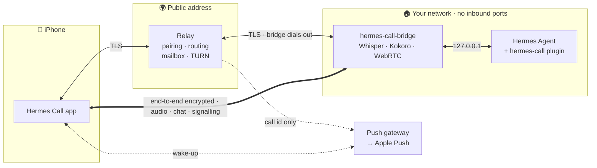
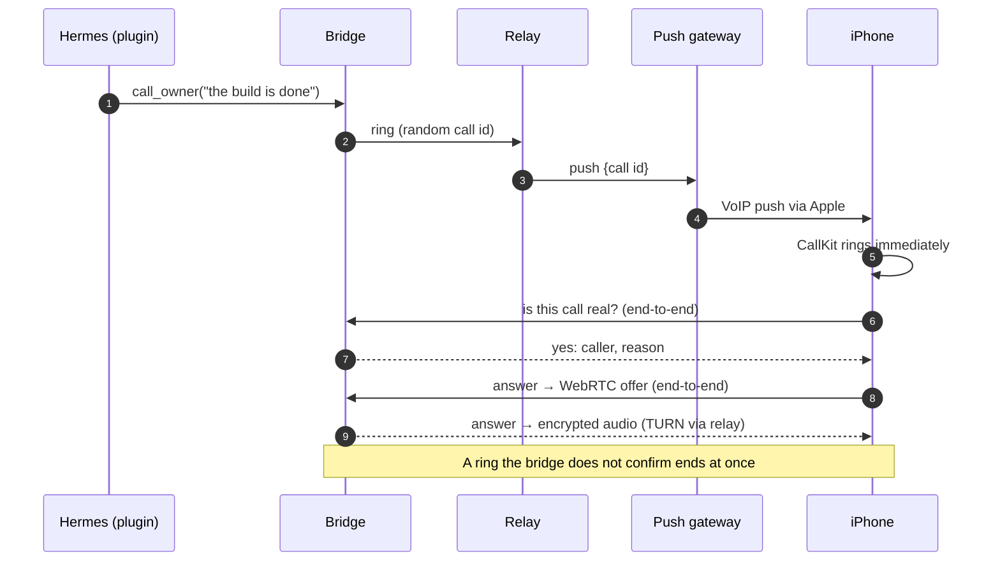

<p align="center">
  
  &nbsp;
  
</p>

```
██╗  ██╗███████╗██████╗ ███╗   ███╗███████╗███████╗     ██████╗ █████╗ ██╗     ██╗
██║  ██║██╔════╝██╔══██╗████╗ ████║██╔════╝██╔════╝    ██╔════╝██╔══██╗██║     ██║
███████║█████╗  ██████╔╝██╔████╔██║█████╗  ███████╗    ██║     ███████║██║     ██║
██╔══██║██╔══╝  ██╔══██╗██║╚██╔╝██║██╔══╝  ╚════██║    ██║     ██╔══██║██║     ██║
██║  ██║███████╗██║  ██║██║ ╚═╝ ██║███████╗███████║    ╚██████╗██║  ██║███████╗███████╗
╚═╝  ╚═╝╚══════╝╚═╝  ╚═╝╚═╝     ╚═╝╚══════╝╚══════╝     ╚═════╝╚═╝  ╚═╝╚══════╝╚══════╝
```

<p align="center">
  <b>Phone calls and chat between your iPhone and your own <a href="https://hermes-agent.nousresearch.com/">Hermes Agent</a>.</b><br>
  Self-hosted · end-to-end encrypted · no inbound ports on your Hermes host
</p>

<p align="center">
  <a href="https://github.com/Quavon-dev/hermes-call/actions/workflows/ci.yml"></a>
  <a href="https://github.com/Quavon-dev/hermes-call/releases/latest"></a>
  
  <a href="LICENSE"></a>
</p>

Your agent rings your iPhone like a real call, also on the lock screen. You call it or text it from
the app, and it can ask your phone for the context you allow. Everything runs on hardware you own:
a small **relay** with a public address, and a **bridge** next to Hermes that never accepts inbound
connections. The relay only ever sees ciphertext.

---

## ⚡ Quick start (Proxmox VE)

**1 · Relay**: one command on the Proxmox host, as root:

```bash
bash -c "$(curl -fsSL https://raw.githubusercontent.com/Quavon-dev/hermes-call/main/proxmox-helper/ct/hermes-call-relay.sh)"
```

It creates an unprivileged Debian 13 container, installs the **signed** release (checked before
anything runs) and asks two things:

| Question | Your answer |
|---|---|
| **Domain** for the relay | e.g. `relay.example.com`, or empty for your public IP (self-signed, pinned by the app) |
| Who handles **HTTPS**? | **This relay** (Let's Encrypt, forward TCP 443) or **my reverse proxy** (Nginx Proxy Manager, Traefik, Caddy → `http://<container>:8743`, Websockets on) |

Forward **TCP/UDP 3478** and **UDP 49160–49200** from your router to the container (voice relay).
Pushes reach the phone through the Hermes Call push gateway, so no Apple account is needed.

**2 · Bridge**: into the container that runs Hermes (replace `121` with its ID):

```bash
pct exec 121 -- bash -c 'apt-get install -y -qq git >/dev/null && git clone --depth 1 https://github.com/Quavon-dev/hermes-call /root/hermes-call && /root/hermes-call/bridge/install.sh install --configure-hermes'
```

**3 · Pair**:

```bash
pct exec <relay-id> -- hermescall-relay pair                    # prints a link
pct exec 121 -- hermes-call-bridge relay add '<link>'
pct exec 121 -- systemctl restart hermes-call-bridge
pct exec 121 -- hermes-call-bridge device add --name iPhone     # shows a QR code
```

Scan the QR code with the app, then restart Hermes and its gateway once so they load the plugin.
**App**: TestFlight (public link coming with the review demo) or
[build it yourself](docs/ios.md#build-your-own-copy).

<details>
<summary><b>Not on Proxmox?</b> VPS, other hosts, unattended installs</summary>

| Part | Where | How |
|---|---|---|
| Relay | small VPS or LXC with a public address (Debian 12/13, Ubuntu 24.04) | `relay/install.sh install --domain relay.example.com` ([docs](docs/relay.md)) |
| Relay behind your proxy | same, TLS by Nginx Proxy Manager/Traefik/Caddy | `relay/install.sh install --domain … --tls proxy --proxy-from <proxy IP>` ([docs](docs/relay.md#behind-your-own-reverse-proxy-nginx-proxy-manager-traefik-caddy)) |
| Bridge + plugin | next to Hermes | `bridge/install.sh install --configure-hermes` ([docs](docs/bridge.md)) |
| iPhone app | TestFlight, then the App Store | or Xcode with your own team ([docs](docs/ios.md)) |

Proxmox helper without questions:
`var_relay_address=relay.example.com var_relay_tls=proxy var_relay_proxy_from=192.168.0.10 bash -c "$(curl …)"`.

</details>

---

## ✨ What you get

| | |
|---|---|
| 📞 **Calls both ways** | Real CallKit calls, WebRTC audio, Whisper speech recognition (on the bridge or on the iPhone), Kokoro voice, barge-in, push to talk, live captions |
| 💬 **Chat** | Replaces a messenger bot: text, photos, files, voice notes (answered by voice if you like), notifications decrypted on the phone, share sheet, Siri and Shortcuts |
| 📍 **Phone context** | Location, calendar, reminders, contacts, battery, health summary, Home, clipboard, photos, files, place reminders: each **No / Ask / Yes**, **No** by default, every request logged |
| 🃏 **Results as cards** | Places, links and lists; the bridge fetches images so the phone never contacts third parties |
| ⏳ **Tasks** | Long agent work as a progress ring and a Live Activity on the Lock Screen and in the Dynamic Island |
| 👁️ **"Look at this"** | During a call, show the agent what the camera sees |
| 🛡️ **Approvals** | Dangerous commands need Face ID on the phone, never just a spoken "yes" |
| 🔮 **Presence** | Optional full-screen interactive Metal "presence" with the real voice spectrum; one colour per agent |
| ⌚ **Everywhere** | Apple Watch, widgets, Control Center, call back from the Phone app's Recents |

---

## 🧭 How it works



**Pairing** uses CPace with a short code or QR (the observed TLS key is bound in, so a self-signed
relay is never trusted silently). **Signalling and chat** are libsodium `crypto_box` between phone
and bridge; **audio** is DTLS-SRTP. The relay forwards bytes it cannot read.

<details>
<summary><b>An incoming call, step by step</b></summary>



</details>

---

## 🔒 Privacy

No analytics, no crash reporting, no third-party services. Audio, messages, attachments and phone
answers are end-to-end encrypted between your phone and your bridge; the relay sees only who talks to
whom, when and how much. Apple, and the [push gateway](docs/push-gateway.md) your relay uses unless it
has its own APNs key, see push tokens and timing, never content. What the agent may read from your
phone is off until you turn it on. Details, including what is out of scope:
[THREAT_MODEL.md](THREAT_MODEL.md).

---

## 📚 Documentation

| | |
|---|---|
| [Relay](docs/relay.md) | install, ports, reverse proxy, Proxmox isolation, secrets |
| [Bridge and plugin](docs/bridge.md) | voice pipeline, Hermes integration, phone context |
| [iOS app](docs/ios.md) | building, TestFlight, automatic releases, APNs |
| [Push gateway](docs/push-gateway.md) | what it sees, protocol, running your own |
| [Wire protocol](docs/protocol.md) · [chat design](docs/chat-design.md) | for implementers |
| [Threat model](THREAT_MODEL.md) · [security policy](SECURITY.md) | reporting vulnerabilities |
| [Changelog](CHANGELOG.md) · [contributing](CONTRIBUTING.md) | |

<details>
<summary><b>Repository layout</b></summary>

| Path | What |
|---|---|
| `relay/` | relay, push gateway, installers, container image |
| `bridge/` | `hermes-call-bridge` next to Hermes |
| `hermes-integration/` | Hermes plugin: `call_owner`, `phone_context`, `present_to_owner`, `hermes_call` chat platform |
| `common/` | shared protocol and crypto (libsodium, CPace) |
| `ios/` | SwiftUI app, extensions, Apple Watch app |
| `proxmox-helper/` | community-scripts style LXC helper, installs only signed releases |
| `testclient/` | command-line stand-in for the iPhone |
| `tools/` | dev stack, release signing, App Store Connect automation |

</details>

<details>
<summary><b>Development</b></summary>

```bash
brew install libsodium shellcheck xcodegen && uv sync
uv run ruff check . && uv run pytest -q bridge/tests common/tests relay/tests tools/tests
(cd ios/HermesCallKit && swift test)
```

Local end-to-end stack (relay + bridge + fake Hermes on your LAN):
`uv run python tools/dev_stack.py --host <your LAN IP>`. Installer tests in systemd containers:
`./relay/tests/container_e2e.sh debian:12` and `./bridge/tests/container_e2e.sh`. More in
[CONTRIBUTING.md](CONTRIBUTING.md).

</details>

---

<p align="center">
MIT © Quavon UG (haftungsbeschränkt) · <a href="THIRD_PARTY_NOTICES.md">third-party notices</a><br>
<sub>The app icons and the presence are original work. Hermes Call is not affiliated with Nous Research.</sub>
</p>
