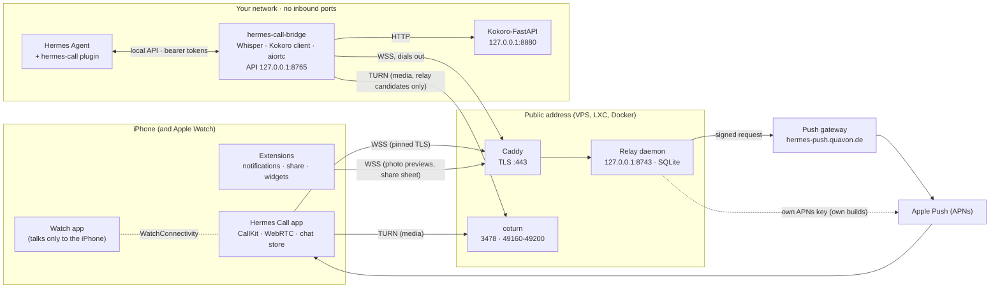
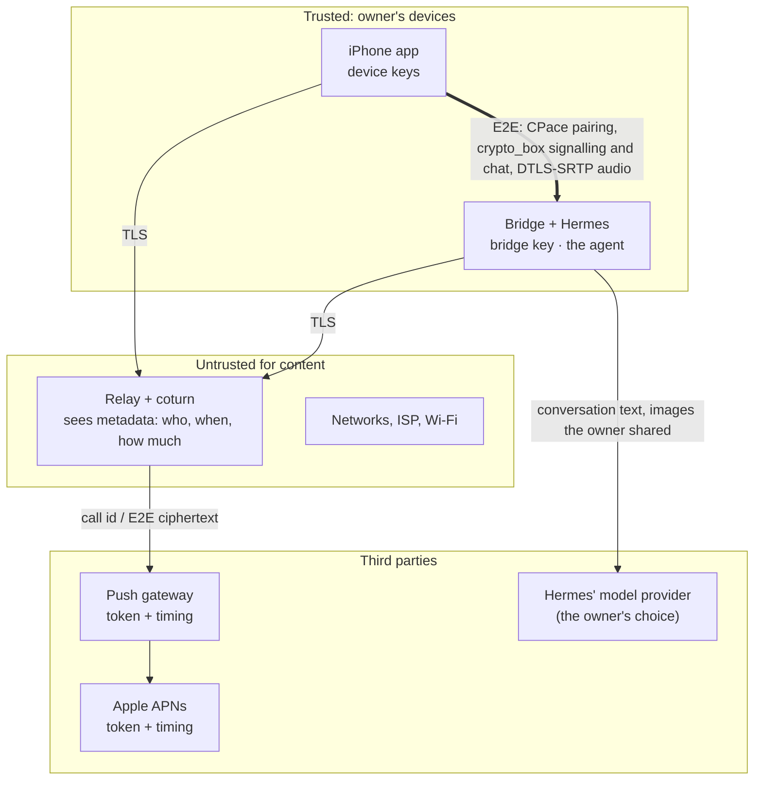
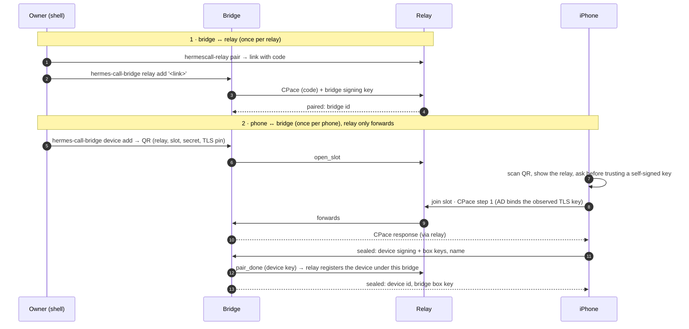

# Architecture

How the parts fit together, what crosses which boundary, and how big a relay needs to be. The
exact messages are in [protocol.md](protocol.md), the security argument in
[THREAT_MODEL.md](../THREAT_MODEL.md).

## Components



| Part | Runs where | Keeps | Code |
|---|---|---|---|
| App | iPhone | device keys (Keychain), chat history (SQLite in the app group), settings | `ios/` |
| Relay | any host with a public address | public keys of paired bridges and devices, push tokens, queued ciphertext, encrypted attachments (7 days) | `relay/hermescall_relay` |
| coturn | next to the relay | nothing (ephemeral HMAC credentials) | installed by `relay/install.sh` |
| Bridge | next to Hermes (same host or container) | bridge key, paired device public keys, pairing state | `bridge/` |
| Plugin | inside Hermes | nothing; ring and chat tokens in Hermes' `.env` | `hermes-integration/` |
| Push gateway | Quavon (or your own) | signature hashes (2 min), token-hash → relay ids (30 days) | `relay/hermescall_relay/gateway.py`, [push-gateway.md](push-gateway.md) |

## Trust boundaries



- Everything that matters (audio, text, attachments, phone answers, approvals) is end-to-end
  encrypted between the phone and the bridge. The relay forwards bytes it cannot read and cannot
  forge (every E2E message is authenticated and replay-protected).
- The relay, coturn, the push gateway and Apple see **metadata**: addresses, timing, sizes, push
  tokens. The threat model lists exactly what each one sees.
- The bridge and Hermes are the trust anchor: what the agent does with what it hears is the
  owner's choice of agent and model provider (the app asks for consent before anything is shared).

## Pairing

Two pairings, both with one-time codes (10 minutes, 3 attempts) and CPace, a password-authenticated
key exchange: whoever relays the messages learns nothing and gets one guess per attempt.



A TLS man-in-the-middle during pairing changes the observed key, so the CPace keys differ and
pairing fails; a malicious relay gets no more guesses than anyone else (the bridge counts too).

## Incoming call (agent → phone)

```mermaid
sequenceDiagram
    autonumber
    participant H as Hermes (plugin)
    participant B as Bridge
    participant R as Relay
    participant G as Push gateway
    participant A as APNs
    participant P as iPhone
    H->>B: POST /v1/calls (ring token): call_owner(reason, first message)
    B->>R: ring (random 128-bit call id)
    alt phone online
        B->>P: E2E invite (via relay)
    else phone asleep
        R->>G: signed voip push {call id}
        G->>A: VoIP push
        A->>P: wake → CallKit rings at once (iOS requires it)
        P->>B: E2E invite_query(call id)
        B-->>P: E2E: real, caller, reason (else the ring ends within 15 s)
    end
    P->>B: E2E answer + WebRTC offer
    B-->>P: E2E WebRTC answer (TURN relay candidates only)
    P->>B: DTLS-SRTP audio through coturn
    B->>H: speech → Whisper → text; reply text → Kokoro → audio
```

A phone call to the agent is the same without the push: the app sends the offer, the bridge
answers. Calls end after 60 minutes at the latest.

## Chat message and notification

```mermaid
sequenceDiagram
    autonumber
    participant H as Hermes (plugin)
    participant B as Bridge
    participant R as Relay
    participant G as Push gateway
    participant A as APNs
    participant N as Notification extension
    participant P as App
    H->>B: reply text / file (chat platform hermes_call)
    opt attachment
        B->>R: blob_put → PUT /v1/blobs/id (XChaCha20 with a random key)
    end
    B->>R: mail {to, id, E2E envelope (text, blob key), alert: true}
    alt app connected
        R->>P: mail → decrypt, show, ack
    else no ack within 3 s
        R->>G: signed alert push {"New message", E2E ciphertext ≤ 3600 chars}
        G->>A: alert push
        A->>N: mutable-content
        N->>N: decrypt with the device key; name + text if the owner allows
        opt photo preview, app not running
            N->>R: own connection · blob_get → download, decrypt
        end
        N-->>A: communication notification (agent as sender)
        P->>R: later: mail_fetch → decrypt → mail_ack (deleted at the relay)
    end
```

Messages from the phone go the other way through the same E2E channel (the bridge is always
connected); the outbox in the app's database keeps them until the bridge confirms.

## Capacity

These are planning figures, not guarantees; measure your own with `hermescall-relay stats` and
the optional `/metrics` listener ([relay.md](relay.md#health-metrics-logs)).

| Resource | Figure | Notes |
|---|---|---|
| Relay process | 1 process, 1 SQLite database (single writer) | no clustering; run more relays rather than a bigger one |
| Connections | 500 in total, 16 per IP (defaults, `relay.toml` `[limits]`) | a phone and a bridge hold one each, the share and notification extensions briefly one more |
| Households per relay | tens of bridges with a handful of phones each, on 1 vCPU / 512 MB | `max_devices_per_bridge` 20 |
| Concurrent calls | ≈ 20 with the default media range 49160-49200 (2 ports per call) | `--turn-ports` widens it, `--turn-quota` caps allocations |
| TURN bandwidth | ≈ 50 kbit/s per audio stream (Opus, constant bitrate, plus packet overhead); every call is relayed on both legs, so ≈ 100 kbit/s in and ≈ 100 kbit/s out at the relay per call | 20 calls ≈ 2 Mbit/s each way; upload of a home line is usually the limit |
| "Look at this" images | up to 1 image/s per call, JPEG ≤ 1280 px (typically 100-300 KB) | over the relay's HTTPS blob endpoint, not TURN |
| Storage | 2 GiB total by default (`storage_max_bytes`); per phone 500 messages / 20 MiB mailbox, 50 MiB attachments, 7 days | `min_free_bytes` keeps 256 MiB free; `/healthz` turns 503 below it |
| Bridge | one Hermes, one call at a time | Whisper `base.en` on 2 cores is the practical minimum; see [bridge.md](bridge.md#resources) |

## Backups and upgrades

| Part | Backup | Upgrade | Way back |
|---|---|---|---|
| Relay | `install.sh backup` (database, keys, config; [relay.md](relay.md#backup-and-restore)) | run the Proxmox helper's update, or `install.sh update` from a signed release ([relay.md](relay.md#updates-rollback-and-status)) | `install.sh rollback` (code), `rollback --restore-db` (database snapshot) |
| Bridge | `/etc/hermes-call-bridge` and `/var/lib/hermes-call-bridge` (keys, paired devices) | `bridge/get.sh` again ([bridge.md](bridge.md)) | `get.sh` with `HC_RELEASE_URL=https://github.com/Quavon-dev/hermes-call/releases/download/<older tag>` and `HC_ALLOW_DOWNGRADE=1` |
| App | history is on the phone (iCloud/device backup, keys excluded: pair again after a restore to a new phone) | App Store | – |
| Push gateway | its state is abuse protection only; losing it is harmless | container image by digest ([push-gateway.md](push-gateway.md)) | previous digest |

Releases are signed and installers refuse older versions than the installed one unless forced;
see [releasing.md](releasing.md).
